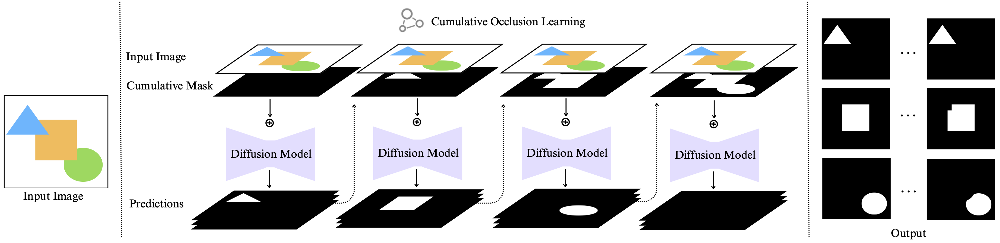
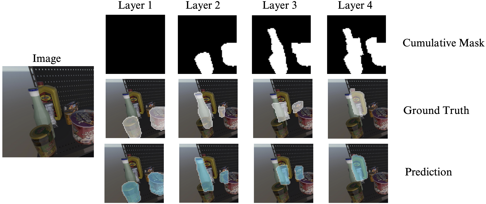

# Sequential Amodal Segmentation via Cumulative Occlusion Learning (BMVC2024)

<p align="center">
  <p align="center" margin-bottom="0px">
    <a href="https://jiayangao.github.io/"><strong>Jiayang Ao</strong></a>
    ·
    <a href="https://research.monash.edu/en/persons/qiuhong-ke/"><strong>Qiuhong Ke</strong></a>
    ·
    <a href="http://www.kehinger.com/"><strong>Krista A. Ehinger</strong></a>
    <p align="center">
    <a href="https://arxiv.org/abs/2405.05791" style="text-decoration:none;">
      
    </a>
    <a href="" style="text-decoration:none;">
      
    </a>
    <a href="https://opensource.org/licenses/MIT" style="text-decoration:none;">
      
    </a>
  </p>
</p>

## Introduction
We introduce a diffusion model with cumulative occlusion learning designed for sequential amodal segmentation of objects without specifying their categories. This model iteratively refines the prediction using the cumulative mask strategy during diffusion, effectively capturing the uncertainty of invisible regions and adeptly reproducing the complex distribution of shapes and occlusion orders of occluded objects. It is akin to the human capability for amodal perception, i.e., to decipher the spatial ordering among objects and accurately predict complete contours for occluded objects in densely layered visual scenes. 

## Methodology
Our model receives an RGB image as input and predicts multiple plausible amodal masks layer-by-layer, starting with the unoccluded objects and proceeding to deeper occlusion layers. Each layer's mask synthesis receives as input the cumulative occlusion mask from previous layers, thus providing a spatial context for the diffusion process and helping the model better segment the remaining occluded objects.



## Model Prediction
Our model sequentially predicts the amodal masks for each object in an RGB input image. It employs a cumulative mask, which aggregates the masks of previously identified objects. This strategy allows the model to maintain a clear record of areas already segmented, directing its focus toward unexplored regions. Our method can generate reliable amodal masks layer by layer and allows multiple objects per layer.




## Getting Started

We will update the code soon.

### License

This project is licensed under the MIT License - see the [LICENSE](https://github.com/saraao/SAS/blob/main/LICENSE) file for details.

### Acknowledgments

We thank the following papers for their open-source code and datasets:
- Diffusion Models for Implicit Image Segmentation Ensembles [[PMLR 2022]](https://proceedings.mlr.press/v172/wolleb22a)  
- Amodal Intra-class Instance Segmentation: Synthetic Datasets and Benchmark [[WACV 2024]](https://github.com/saraao/amodal-dataset)
- MUVA: A New Large-Scale Benchmark for Multi-View Amodal Instance Segmentation in the Shopping Scenario [[ICCV 2023]](https://zhixuanli.github.io/project_2023_ICCV_MUVA/)


## Citation

If you find this helpful in your work, please consider citing our paper:
```
@inproceedings{ao2024sequential,
  title={Sequential Amodal Segmentation via Cumulative Occlusion Learning},
  author={Ao, Jiayang and Ke, Qiuhong and Ehinger, Krista A},
  booktitle={Proceedings of the 35th British Machine Vision Conference},
  year={2024}
}
```

# Contact
If you have any questions regarding this work, please send email to jiayang.ao@student.unimelb.edu.au.
